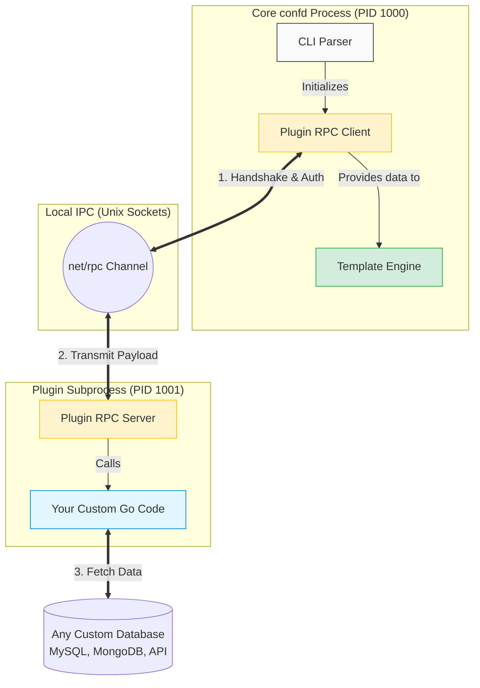
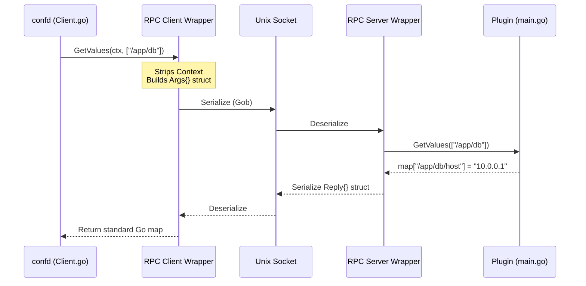
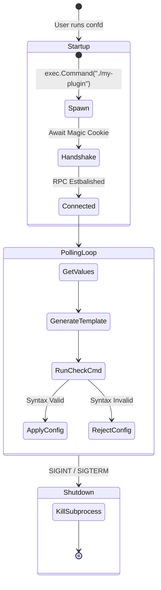

# 🧠 Deep Dive: The Confd Dynamic Plugin Architecture

This document provides a comprehensive, highly-detailed exploration of the `go-plugin` architectural migration implemented in this fork of `confd`. 

By decoupling the data layer from the templating engine, we have transformed `confd` from a monolithic binary into a highly extensible configuration orchestration platform.

---

## 1. The Monolithic Problem

Historically, `confd` was designed as a static binary. Every supported backend (etcd, Consul, Redis, Vault, DynamoDB) was hardcoded into `pkg/backends/client.go`. 

### The Bottleneck
If an organization wanted to source configuration data from a proprietary internal API, a custom database schema, or a newly released cloud service, they faced significant hurdles:
1. Fork the upstream `confd` repository.
2. Implement the Go interface within the core source code.
3. Manage dependencies (`go.mod`) that might conflict with `confd`'s core dependencies.
4. Recompile and distribute the custom `confd` binary.
5. Suffer through endless merge conflicts when trying to pull upstream updates.

---

## 2. The Plugin Solution (HashiCorp `go-plugin`)

To solve this, we introduced the `--backend plugin` command-line argument, powered by [HashiCorp's `go-plugin`](https://github.com/hashicorp/go-plugin) framework (the exact same framework used by Terraform for its Providers).

### What does this mean?
`confd` no longer needs to know *how* to talk to your database. It simply launches an external standalone binary (your custom plugin) as a hidden subprocess. `confd` and the plugin then communicate continuously over an encrypted local RPC (Remote Procedure Call) connection over Unix Sockets.



---

## 3. The API Contract: `BackendProvider`

For the two separate processes to understand each other, they must agree on a strict contract. We defined this contract in `pkg/backends/plugin/api/api.go`.

Any plugin written for `confd` must simply implement this Go interface:

```go
type BackendProvider interface {
	GetValues(keys []string) (map[string]string, error)
	WatchPrefix(prefix string, keys []string, waitIndex uint64) (uint64, error)
	HealthCheck() error
	Close() error
}
```

### Bridging the Gap (`net/rpc`)
Because the two applications run in different memory spaces, they cannot pass standard Go objects like `context.Context` or `chan bool` (Channels) to each other. 
Our RPC Server wrapper automatically intercepts `confd`'s native function signatures and converts them into RPC-friendly flat objects (`structs`).



---

## 4. Lifecycle Management

One of the greatest benefits of the `go-plugin` architecture is that `confd` remains the orchestrator.

1. **Initialization**: When `confd` starts, it looks for the binary provided in `--plugin-path`. It executes it silently.
2. **Handshake**: The plugin writes its listening Unix Socket address to standard output. `confd` reads it, authenticates using a cryptographic Magic Cookie (`CONFD_PLUGIN`), and establishes the connection.
3. **Execution**: `confd` enters its normal polling or watch loop, firing RPC calls seamlessly.
4. **Termination**: If `confd` receives a `SIGINT` (Ctrl+C), it gracefully calls the `.Kill()` method on the plugin client. The plugin subprocess is immediately destroyed, leaving zero zombie processes behind.



---

## 5. Security & Isolation Benefits

Isolating the data retrieval layer provides incredible security properties for production environments:

* **Crash Isolation**: If your custom plugin suffers from a memory leak, a null-pointer exception, or a panic, **it will not crash `confd`**. The RPC call will simply timeout or fail, `confd` will log an error, and the previous known-good configuration will remain safely running on your servers.
* **Network Isolation**: The plugin binary can be granted specific firewall rules (e.g., allowed to talk to the DB port) while the main `confd` binary is completely restricted from external network access.
* **Language Agnosticism**: While HashiCorp provides SDKs for Go, the `go-plugin` underlying protocol supports gRPC. This means a DevOps team could theoretically write a `confd` backend plugin in **Python**, **Rust**, or **Node.js**!

---

## 6. How to Build Your Own Plugin

Building a plugin requires zero knowledge of the `confd` templating engine. You only need to import the `api` package and serve it.

### Step 1: Implement the `BackendProvider` interface

```go
package main

import (
	"flag"
	"github.com/abtreece/confd/pkg/backends/plugin/api"
	"github.com/hashicorp/go-plugin"
)

// 1. Create your custom struct
type MyCustomBackend struct {
	Endpoint string
}

// 2. Implement the 4 methods
func (b *MyCustomBackend) GetValues(keys []string) (map[string]string, error) {
    return map[string]string{"/hello": "world"}, nil
}
func (b *MyCustomBackend) WatchPrefix(prefix string, keys []string, waitIndex uint64) (uint64, error) {
    return 0, nil
}
func (b *MyCustomBackend) HealthCheck() error { return nil }
func (b *MyCustomBackend) Close() error { return nil }

// 3. Add CLI flags for configuration
func main() {
	endpoint := flag.String("endpoint", "localhost:3000", "Your backend endpoint")
	flag.Parse()

	plugin.Serve(&plugin.ServeConfig{
		HandshakeConfig: api.Handshake,
		Plugins: map[string]plugin.Plugin{
			"backend": &api.ConfdBackendPlugin{
				Impl: &MyCustomBackend{Endpoint: *endpoint},
			},
		},
	})
}
```

### Step 2: Compile your plugin
```bash
go build -o my-plugin main.go
```

### Step 3: Run it with `confd`
```bash
./bin/confd plugin --plugin-path ./my-plugin --interval 10
```

### Step 4: Check your plugin's own CLI
```bash
./my-plugin --help
```
```text
Usage of ./my-plugin:
  -endpoint string
        Your backend endpoint (default "localhost:3000")
```

---

## 7. Testing

The project includes comprehensive unit tests that run **without any external dependencies** (no Docker, no database).

### Run all tests
```bash
go test -v ./pkg/backends/postgres/ ./pkg/backends/plugin/api/
```

### What is tested?

| Package | Tests | What they cover |
| :--- | :---: | :--- |
| `pkg/backends/postgres/` | 9 | DSN construction, prefix matching logic, default values |
| `pkg/backends/plugin/api/` | 13 | RPC Server GetValues/WatchPrefix/HealthCheck/Close, Handshake config, DTO serialization, Plugin boilerplate |

All tests use **in-memory mocks** — no database connection is needed.

---

That's it. Welcome to the future of dynamic configuration management.
