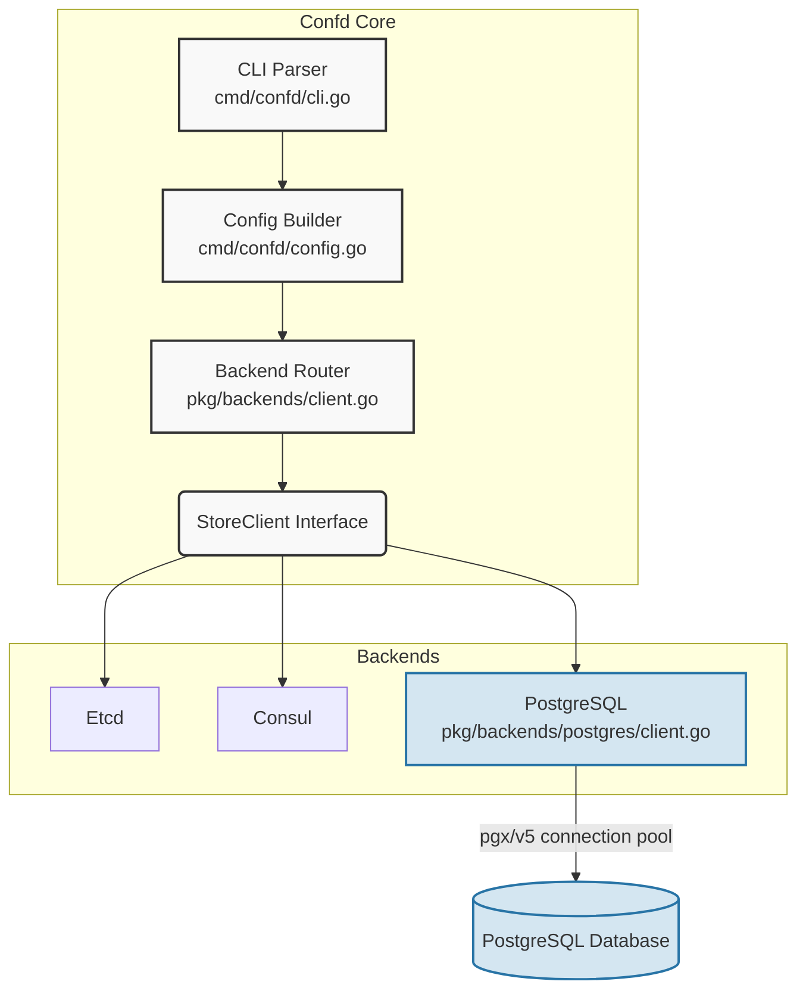

# PostgreSQL Backend Integration

This document details the technical modifications and architectural additions implemented to support PostgreSQL as a native backend for `confd`.

## 1. Architectural Overview

The integration introduces a new `StoreClient` implementation that communicates with a PostgreSQL database. It utilizes the `pgx/v5` driver for high-performance connections and connection pooling.



## 2. Technical Modifications

The implementation required updates across three main layers of the application.

### A. Core Backend Implementation (`pkg/backends/postgres/client.go`)
- **Package creation**: A new package `postgres` was created.
- **Client structure**: Implements `backends.StoreClient` using `*pgxpool.Pool` to manage database connections efficiently.
- **Data retrieval logic**: Implemented `GetValues(ctx, keys)` to execute SQL queries. It performs both exact matching and prefix-based matching (`LIKE`) to replicate the hierarchical directory structure expected by `confd`.
- **Polling fallback**: `WatchPrefix` immediately returns to fallback on `confd`'s native polling mechanism, as PostgreSQL does not natively support tree-based prefix watches.

### B. Configuration Layer (`pkg/backends/config.go` & `cmd/confd/config.go`)
- **Config Struct Updates**: Extended the `backends.Config` and `TOMLConfig` structures to include PostgreSQL-specific settings:
  - `Database`: Name of the target database.
  - `Table`: Name of the table storing configuration key-value pairs.
- **Config Loading**: Updated `loadConfigFile()` to parse the new variables from `confd.toml`.

### C. CLI Layer (`cmd/confd/cli.go`)
- **Command Addition**: Added the `PostgresCmd` structure to parse CLI flags.
- **Default Values**: Configured defaults to streamline local usage (`127.0.0.1:5432`, `confd_config`).

## 3. Configuration Reference

The PostgreSQL backend can be configured using CLI flags or the `confd.toml` configuration file.

| CLI Flag | TOML Setting | Description | Default Value |
| :--- | :--- | :--- | :--- |
| `-n, --node` | `nodes` | Database host and port | `127.0.0.1:5432` |
| `--username` | `username` | Authentication username | `""` (none) |
| `--password` | `password` | Authentication password | `""` (none) |
| `--database` | `database` | Name of the database | `confd` |
| `--table` | `table` | Name of the table holding config | `confd_config` |
| `--interval` | `interval` | Polling interval (seconds) | `600` |

## 4. Database Schema Requirements

The backend assumes a specific table structure to retrieve configurations. The table must contain at minimum two string columns: `key` and `value`.

```sql
CREATE TABLE confd_config (
    key VARCHAR(255) PRIMARY KEY,
    value TEXT NOT NULL
);
```

## 5. Dependency Management
- Added `github.com/jackc/pgx/v5` to `go.mod`.
- Executed `go mod vendor` to include the driver in the project's vendor directory, ensuring reproducible builds.
