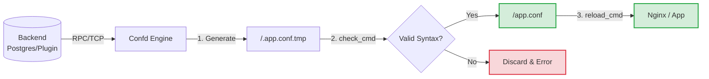

# 🛠️ Confd (Next-Gen Fork) 

[](https://goreportcard.com/report/github.com/abtreece/confd)
[](https://opensource.org/licenses/MIT)

> **Welcome to the next generation of `confd`.**  
> This fork introduces two massive architectural upgrades to the classic lightweight configuration management tool: **Native PostgreSQL integration** and an entirely decoupled **HashiCorp `go-plugin` architecture**.

`confd` is a lightweight configuration management tool focused on keeping local configuration files up-to-date using data stored in a central backend, and invoking reload commands when configuration changes.

---

##  What's New in this Fork?

The classic `confd` is an incredibly reliable tool, but it suffers from a monolithic design: every single backend (Etcd, Redis, Consul, etc.) must be statically compiled into the core binary. This fork breaks that limitation.

### 1.  The Dynamic Plugin Architecture (`go-plugin`)
We have integrated [HashiCorp's `go-plugin`](https://github.com/hashicorp/go-plugin) framework to allow `confd` to load external backends at runtime via RPC/gRPC. 
* **Zero Recompilation:** Write your own custom backend (MongoDB, SQLite, HTTP APIs, internal company systems) in Go, compile it as a standalone binary, and `confd` will talk to it!
* **Decoupled:** The core template rendering engine of `confd` is now completely isolated from the data retrieval logic.
* **Read the Architecture Deep Dive:** [PLUGIN_ARCHITECTURE.md](./PLUGIN_ARCHITECTURE.md)

### 2.  Native PostgreSQL Backend
We added a statically-linked, high-performance PostgreSQL backend powered by `pgx/v5`. 
* **SQL Views Support:** You don't need a dedicated `confd` table. You can map `confd` keys directly to your existing business tables using SQL Views!
* **Security & Validation:** Leverage the power of PostgreSQL Triggers to validate configuration changes *before* they reach `confd`.
* **Full Audit Trail:** Automatically log every configuration mutation directly in your database.
* **Read the Postgres Guide:** [POSTGRES_DEMO.md](./POSTGRES_DEMO.md)

---

## 📖 Getting Started

### Building from Source

```bash
# 1. Sync the vendor directory
go mod vendor

# 2. Build the main confd executable
make build

# 3. (Optional) Build the standalone Postgres Plugin example
go build -o bin/confd-plugin-postgres ./cmd/confd-plugin-postgres
```

### Quick Demos

We have prepared interactive, highly detailed demonstration environments using Docker Compose. They simulate production environments with invalid data injection, maintenance modes, and automatic rollbacks.

* **[The Plugin Demo (Highly Recommended)](./PLUGIN_DEMO.md)**: A complete walkthrough of the dynamic HashiCorp `go-plugin` system.
* **[The PostgreSQL Native Demo](./POSTGRES_DEMO.md)**: A masterclass in using SQL Views and Triggers to control configuration safely.

---

## 💻 Usage

### Using the Native PostgreSQL Backend

```bash
./bin/confd postgres \
  --node "127.0.0.1:5432" \
  --username "admin" \
  --password "secret" \
  --database "confd" \
  --table "confd_config" \
  --interval 3
```

### Using the Dynamic Plugin Backend

```bash
# Configuration for the external plugin is passed via environment variables
export CONFD_BACKEND_NODE="127.0.0.1:5432"

# Tell confd to use the "plugin" backend and point it to the binary
./bin/confd plugin \
  --plugin-path "./bin/confd-plugin-postgres" \
  --interval 3
```

---

##  Architecture Overview

The core engine uses atomic file operations and a strictly enforced `check_cmd` validation step to ensure that a broken template will **never** impact a running production service.



---

##  License

`confd` is licensed under the MIT License. See [LICENSE](LICENSE) for the full text.
