# confd Architecture

This document describes the internal architecture of confd to help contributors and users understand how the system works.

## Table of Contents

- [High-Level Architecture](#high-level-architecture)
- [Package Structure](#package-structure)
- [Data Flow](#data-flow)
- [Processing Modes](#processing-modes)
- [Sequence Diagrams](#sequence-diagrams)
- [Extension Points](#extension-points)

## High-Level Architecture

confd follows a modular architecture with clear separation between configuration parsing, backend communication, template processing, and file management.

### ASCII Diagram

```
┌─────────────────────────────────────────────────────────────────────────────┐
│                                  confd                                       │
├─────────────────────────────────────────────────────────────────────────────┤
│                                                                             │
│  ┌──────────────┐    ┌──────────────┐    ┌──────────────────────────────┐  │
│  │   CLI/Kong   │───▶│    Config    │───▶│         Processor            │  │
│  │   Parsing    │    │   Loading    │    │  (Interval/Watch/Batch)      │  │
│  └──────────────┘    └──────────────┘    └──────────────────────────────┘  │
│         │                   │                          │                    │
│         ▼                   ▼                          ▼                    │
│  ┌──────────────┐    ┌──────────────┐    ┌──────────────────────────────┐  │
│  │    Flags     │    │  conf.d/     │    │     Template Resources       │  │
│  │   Env Vars   │    │  *.toml      │    │   (parse, render, sync)      │  │
│  │  confd.toml  │    │              │    └──────────────────────────────┘  │
│  └──────────────┘    └──────────────┘              │         │             │
│                                                    │         │             │
│                                                    ▼         ▼             │
│                      ┌──────────────┐    ┌────────────┐ ┌────────────┐     │
│                      │   Backend    │◀───│  GetValues │ │  Output    │     │
│                      │   Client     │    │  WatchPfx  │ │  Writer    │     │
│                      └──────────────┘    └────────────┘ └────────────┘     │
│                             │                                │             │
│                             ▼                                ▼             │
│                      ┌──────────────────────────┐     ┌────────────┐       │
│                      │        Backends          │     │ check_cmd  │       │
│                      ├──────────────────────────┤     │ reload_cmd │       │
│                      │ etcd    │ consul │ vault │     └────────────┘       │
│                      │ redis   │ zk     │ ssm   │                          │
│                      │ dynamodb│ env    │ file  │                          │
│                      │ acm     │ imds   │ sm    │                          │
│                      └──────────────────────────┘                          │
│                                                                             │
└─────────────────────────────────────────────────────────────────────────────┘
```

### Mermaid Diagram

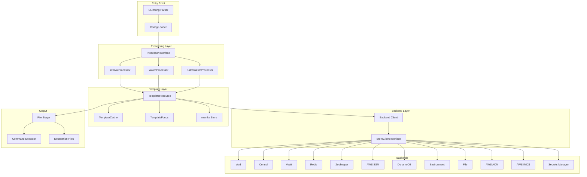

## Package Structure

```
cmd/confd/
├── main.go          # Entry point
├── cli.go           # CLI argument definitions (Kong)
└── config.go        # Configuration file loading

pkg/
├── backends/        # Backend abstraction layer
│   ├── client.go    # StoreClient interface & Factory
│   ├── config.go    # Backend configuration
│   ├── types/       # Shared types (HealthResult)
│   ├── acm/         # AWS ACM backend
│   ├── consul/      # Consul backend
│   ├── dynamodb/    # DynamoDB backend
│   ├── env/         # Environment variables backend
│   ├── etcd/        # etcd backend
│   ├── file/        # File (YAML/JSON) backend
│   ├── imds/        # AWS EC2 IMDS backend
│   ├── redis/       # Redis backend
│   ├── secretsmanager/  # AWS Secrets Manager
│   ├── ssm/         # AWS SSM Parameter Store
│   ├── vault/       # HashiCorp Vault backend
│   └── zookeeper/   # Zookeeper backend
│
├── template/        # Template processing
│   ├── processor.go         # Processor interface & implementations
│   ├── resource.go          # TemplateResource core logic
│   ├── template_funcs.go    # Custom template functions
│   ├── template_cache.go    # Compiled template caching
│   ├── template_renderer.go # Template rendering
│   ├── backend_fetcher.go   # Backend data fetching
│   ├── file_stager.go       # File staging and syncing
│   ├── command_executor.go  # check_cmd/reload_cmd execution
│   ├── client_cache.go      # Backend client caching
│   ├── include.go           # Template includes
│   ├── validate.go          # Configuration validation
│   ├── preflight.go         # Pre-flight checks
│   └── errors.go            # Error types and aggregation
│
├── memkv/           # In-memory key-value store
│   ├── store.go     # Store implementation
│   └── kvpair.go    # KVPair type
│
├── metrics/         # Prometheus metrics
│   ├── metrics.go   # Metric definitions
│   ├── backend.go   # Backend instrumentation wrapper
│   └── health.go    # Health check handlers
│
├── service/         # Service management
│   ├── shutdown.go  # Graceful shutdown coordination
│   ├── reload.go    # SIGHUP reload handling
│   └── systemd.go   # systemd integration
│
├── log/             # Structured logging (slog)
│   └── log.go       # Log wrapper
│
└── util/            # Utilities
    ├── util.go      # File operations
    ├── diff.go      # Diff generation
    └── format.go    # Output formatting
```

### Package Dependencies

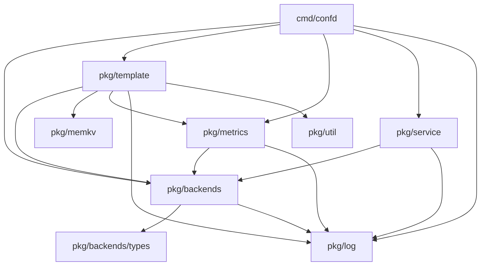

## Data Flow

### Configuration Loading

Configuration is loaded from multiple sources with the following precedence (highest to lowest):

1. Command-line flags
2. Environment variables (`CONFD_*` prefix)
3. Configuration file (`/etc/confd/confd.toml`)
4. Default values

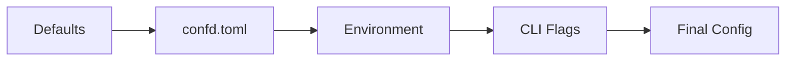

### Template Processing Pipeline

Each template resource goes through a well-defined processing pipeline:

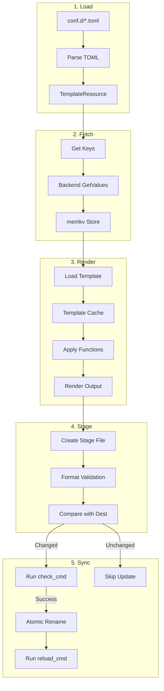

### Key Resolution

Keys specified in template resources are resolved hierarchically:

```
Global Prefix (/production) + Resource Prefix (/myapp) + Key (/database/host)
                                    ↓
                    /production/myapp/database/host
```

## Processing Modes

confd supports three processing modes, each suited for different use cases:

### 1. One-time Mode (`--onetime`)

Processes all templates once and exits. Useful for initialization scripts.

```
Start → Load Templates → Process All → Exit
```

### 2. Interval Mode (default)

Polls the backend at a fixed interval (default: 600 seconds).

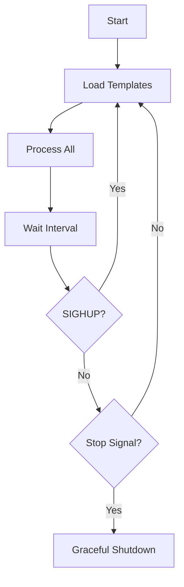

### 3. Watch Mode (`--watch`)

Watches the backend for changes and processes templates immediately when keys change.

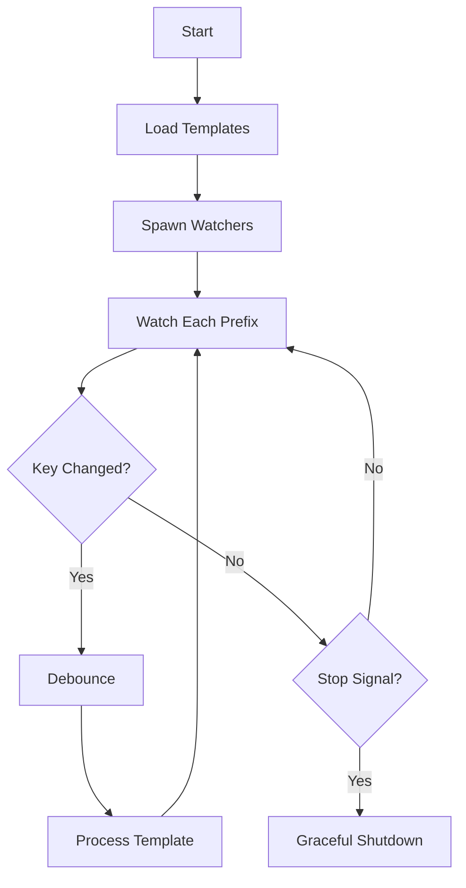

#### Batch Watch Mode (`--watch --batch-interval`)

Collects changes across all templates and processes them together.

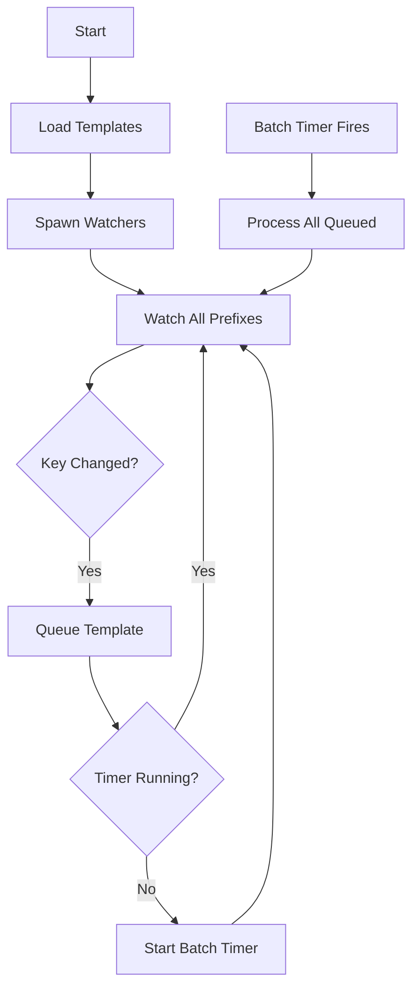

## Sequence Diagrams

### Startup Sequence

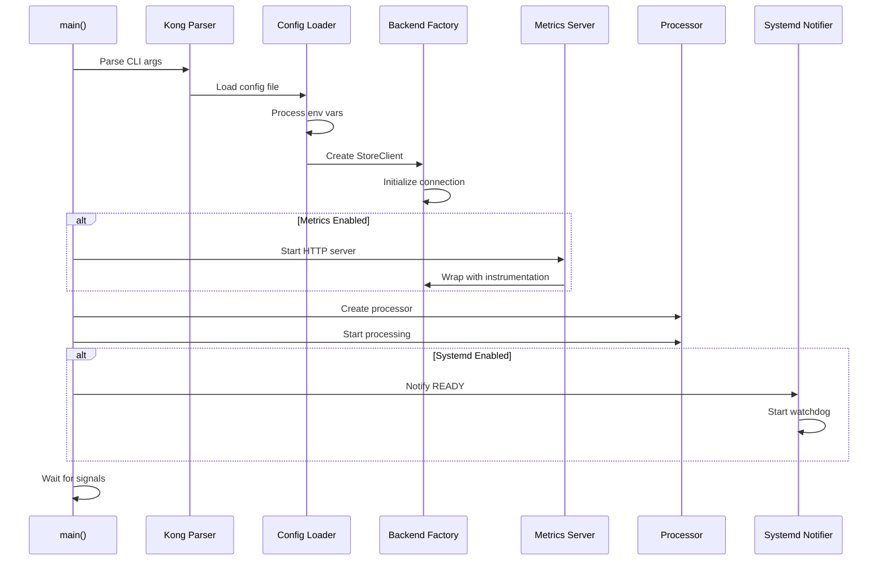

### Template Render Cycle

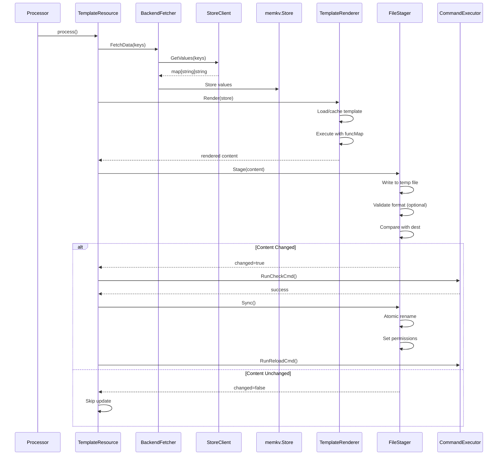

### Graceful Shutdown

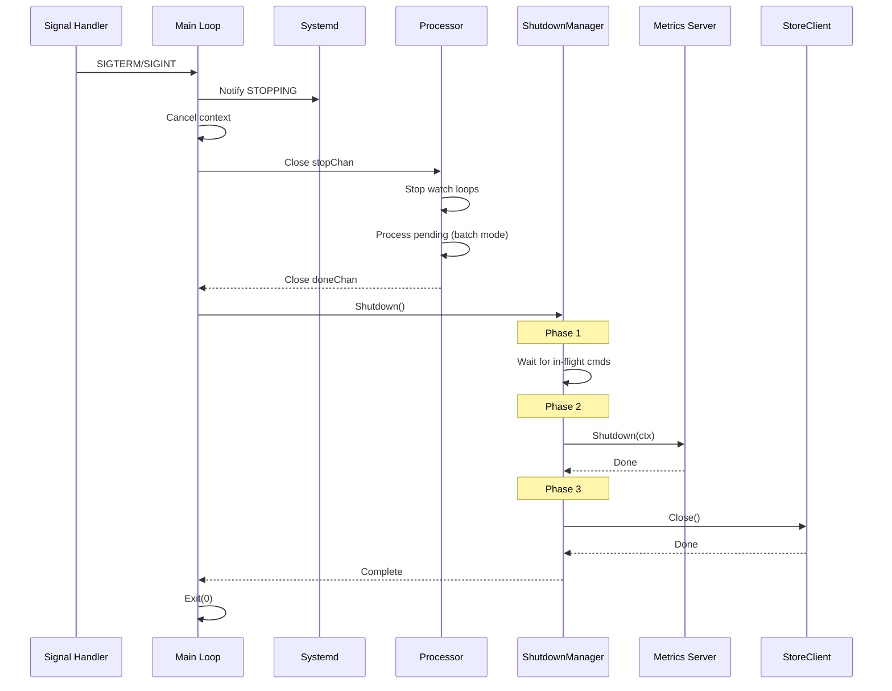

### SIGHUP Reload

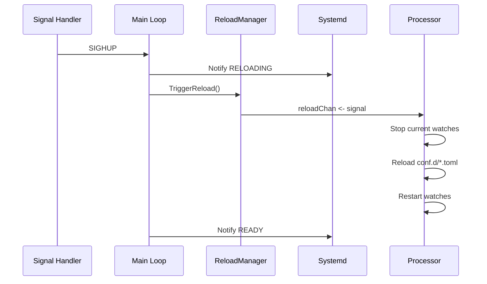

## Extension Points

### Adding a New Backend

1. Create a new package under `pkg/backends/`
2. Implement the `StoreClient` interface:

```go
type StoreClient interface {
    GetValues(ctx context.Context, keys []string) (map[string]string, error)
    WatchPrefix(ctx context.Context, prefix string, keys []string,
                waitIndex uint64, stopChan chan bool) (uint64, error)
    HealthCheck(ctx context.Context) error
    Close() error
}
```

3. Add the backend to the factory in `pkg/backends/client.go`
4. Add CLI command in `cmd/confd/cli.go`

### Adding Template Functions

Add functions to `pkg/template/template_funcs.go`:

```go
func init() {
    funcMap["myFunc"] = func(args ...any) string {
        // Implementation
    }
}
```

### Custom Health Checks

Implement the optional `DetailedHealthChecker` interface for extended diagnostics:

```go
type DetailedHealthChecker interface {
    HealthCheckDetailed(ctx context.Context) (*HealthResult, error)
}
```

## Key Design Decisions

### Why Factory Pattern for Backends?

The `backends.New()` factory allows runtime backend selection based on configuration, making it easy to switch backends without code changes.

### Why Separate Processor Implementations?

Different processing strategies (interval vs watch vs batch) have fundamentally different control flows. Separate implementations keep each mode simple and maintainable.

### Why memkv Store?

The in-memory key-value store provides a consistent interface for templates regardless of backend. It also enables features like `getv`, `gets`, and `lsdir` template functions.

### Why Atomic File Updates?

Writing to a temporary file and using atomic rename ensures that:
- Destination files are never partially written
- Applications reading config see complete files
- File permissions are set correctly before the file is visible

### Why Debouncing in Watch Mode?

Backend changes often come in bursts (e.g., multiple keys updated together). Debouncing prevents unnecessary template re-renders and reload command executions.
